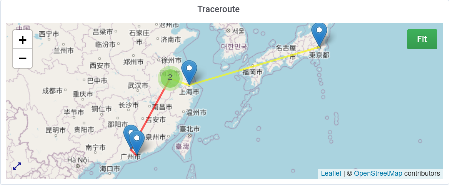

<!--[](https://circleci.com/gh/grafana/simple-react-panel)
[](https://david-dm.org/grafana/simple-react-panel)
[](https://david-dm.org/grafana/simple-react-panel/?type=dev)
[](https://snyk.io/test/github/grafana/simple-react-panel)
[](https://codeclimate.com/github/grafana/simple-react-panel/maintainability)
[](https://codeclimate.com/github/grafana/simple-react-panel/test_coverage)-->


# Traceroute Map Panel
Traceroute Map Panel is a Grafana panel that visualize the traceroute hops in a map, just like [Besttrace](https://www.ipip.net/product/client.html).



## Data
Currently, Traceroute Map Panel is only expected to work with traceroute data collected from [MTR](https://github.com/traviscross/mtr/) via [Telegraf](https://github.com/influxdata/telegraf) and stored in [InfluxDB](https://github.com/influxdata/influxdb).

Telegraf's wiki has [a sample config](https://github.com/influxdata/telegraf/wiki/Traceroute) utilizing the built-in [`[[inputs.exec]]`](https://github.com/influxdata/telegraf/tree/master/plugins/inputs/exec) for this.

### Query
#### Preview via the CLi tool of InfluxDB
```sql
select hop, ip, rtt, loss from (select mean(avg) as rtt, mean(loss) as loss from mtr WHERE now() - 6h < time AND time < now() group by hop, ip, host, dest) group by host, dest
```

#### Query in Grafana
```sql
select mean(avg) as rtt, mean(loss) as loss from mtr WHERE now() - 5m < time group by hop, ip, host, dest
```
& *Format as __Table__*.

Or (see [Notes](#notes)):
```sql
select mean(avg) as rtt, mean(loss) as loss from mtr WHERE $timeFilter group by hop, ip, host, dest
```
.

## Geo IP
This panel relys on external API service for Geo IP resolving. 

The panel ships with two built-in Geo IP service providers: [IP.sb](https://ip.sb) and [IPInfo.io](https://ipinfo.io). The former is free all the time while inaccurate sometimes as it is backed by MaxMind's GeoLite2 database. The latter is a little more accurate in general while rate-limited without API token.

An alternative way is custom API or custom function as long as the target API has proper [CORS header](https://developer.mozilla.org/en-US/docs/Web/HTTP/CORS) set. A sample [Cloudflare Worker](https://workers.cloudflare.com/) script that proxies requests to some third-party service is located in [ipip-cfworker.js](./ipip-cfworker.js).

## Setup 
1. Install & Configure Telegraf and InfluxDB properly.
2. See [Telegraf's wiki](https://github.com/influxdata/telegraf/wiki/Traceroute) to configure MTR data collection as an input.
3. Explore database via the `influx` CLi tool, so that to make sure data is collected as expected. See [the query section](#preview-via-the-cli-tool-of-influxdb).
4. Install the Traceroute Map Panel plugin to Grafana. [v0.1.0](https://github.com/Gowee/traceroute-map-panel/releases/tag/v0.1.0) is meant for Grafana 6.7.x. v0.2+ is meant for Grafana 7.0+. 
    1. Download [the latest tarball](https://github.com/Gowee/traceroute-map-panel/releases/latest).
    2. Uncompress & put the tarball content into Grafana plugin directory (usually `/var/lib/grafana/plugins`).
5. Create a new panel in Grafana:
    1. Choose visualization "Traceroute Map Panel"
    2. In query editor, toggle the text edit mode by clicking the pen icon and enter the query. See [the query section](#query-in-grafana).
    3. At the bottom of the edtior, choose *FORMAT AS Table* instead of *Time Series*.
6. Setup Geo IP service provider, optionally.

## Notes
### Time filter
The panel is not really time-series aware in the sense that it expects only static route path for one src-dest pair.
If there is dynamic routing (e.g. multiple route paths for one src-dest pair), the paths displayed on the map may get disrupted in unexpected ways. So it is generally a good idea to hardcode the `$timeFilter` to be a small range, such as `now() - 5m < time` (recent 5 mins) to circumvent the case.

### Keeping loading for long
In the current implementation, the Geo IP resolving is sequential, instead of concurrent. So it is predicatable that the map keeps loading for a long while at the first time. The resolving result is then cached in sessionStorage.

### Error processing data
If it errors with "Error processing data", the problem could be failures in Geo IP resolving or invalid query data (response data is empty or the data is not [*Formatted as Table*](#query-in-grafana)). The detailed error is logged in the [debugging console](https://developer.mozilla.org/en-US/docs/Web/API/Console).