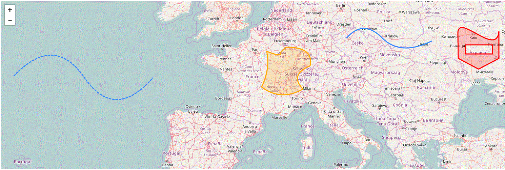

# react-leaflet-curve
Bezier Curve - a React component build on top of [React-Leaflet](https://github.com/PaulLeCam/react-leaflet) that integrate [leaflet-curve](https://github.com/elfalem/Leaflet.curve) feature.




# Getting started

```
import React from 'react';
import { Map, Circle, TileLayer, LayersControl, FeatureGroup, Marker, Polyline } from 'react-leaflet'
import { Curve } from 'react-leaflet-curve'

const path = ['M', [50.14874640066278, 14.106445312500002],
  'Q', [51.67255514839676, 16.303710937500004],
  [50.14874640066278, 18.676757812500004],
  'T', [49.866316729538674, 25.0927734375]]

<Curve positions={path} option={{color:'red',fill:true}}/>
```

For more details on how to use this plugin check the example.

### API

|Command|Parameters|Description|
|-------|----------|-----------|
|M|[lat,lng]+|move to [lat,lng]|
|L|[lat,lng]+|line to [lat,lng]|
|H|[lng]+|horizontal line to [lng]|
|V|[lat]+|vertical line to [lat]|
|C|([lat1,lng1],[lat2,lng2],[lat,lng])+|cubic Bézier curve to [lat,lng] with control points at [lat1,lng1] and [lat2,lng2]|
|S|([lat2,lng2],[lat,lng])+|cubic bézier curve to [lat,lng] with control points at reflection of second control point of previous curve [lat1,lng1] and [lat2,lng2]|
|Q|([lat1,lng1],[lat,lng])+|quadratic Bézier curve to [lat,lng] with control point at [lat1,lng1]|
|T|([lat,lng])+|quadratic Bézier curve to [lat,lng] with control point at reflection of control point of previous curve [lat1,lng1]|
|Z||close path (line to M)|

Note that only absolute commands (uppercase) are implemented. It's possible to approximate elliptical arcs (command 'A') with Bézier curves (the `elliptical-arc` branch implements this command if you're interested).

For more details on how to use this plugin check the example. 